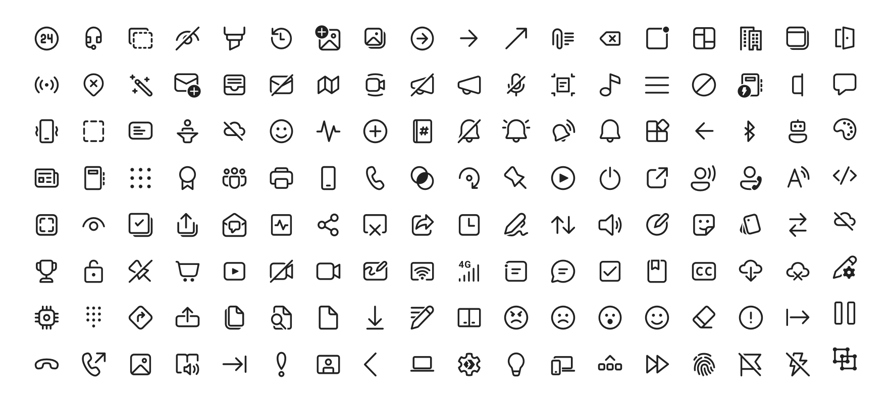

# Fluent UI System Icons - Kotlin Multiplatform

[](https://search.maven.org/search?q=g:%22io.github.niyajali%22%20AND%20a:%22fluentui-system-icons%22)
[](https://opensource.org/licenses/MIT)
[](http://kotlinlang.org)
[](https://www.jetbrains.com/lp/compose-mpp/)

> **Note**: This is a fork of the
> original [Microsoft FluentUI System Icons](https://github.com/microsoft/fluentui-system-icons) repository,
> specifically created to provide Kotlin Multiplatform and Compose Multiplatform support.

Fluent UI System Icons are a collection of familiar, friendly and modern icons from Microsoft, now available for Kotlin
Multiplatform projects with full Compose Multiplatform support.



## 🌐 Interactive Web Catalog

Browse and copy icons with our interactive web catalog: **[Open Catalog](https://niyajali.github.io/fluentui-system-icons)**

✨ **Features:**
- 🔍 Search and filter through all available icons
- 📋 Copy SVG code directly to clipboard
- 🎨 Copy Jetpack Compose references (e.g., `FluentIcons.Filled.FileEdit`)
- 🌙 Dark/Light theme support
- 📱 Responsive design for all devices

## Installation

### Using Version Catalog (Recommended)

Add to your `gradle/libs.versions.toml`:

```toml
[versions]
fluentui-icons = "${latest_version}"

[libraries]
fluentui-system-icons = { module = "io.github.niyajali:fluentui-system-icons", version.ref = "fluentui-icons" }
```

Then in your module's `build.gradle.kts`:

```kotlin
kotlin {
    sourceSets {
        commonMain.dependencies {
            implementation(libs.fluentui.system.icons)
        }
    }
}
```

## Usage

### Basic Usage

```kotlin
@Composable
fun MyScreen() {
    Column(
        modifier = Modifier.padding(16.dp),
        verticalArrangement = Arrangement.spacedBy(8.dp)
    ) {
        // Filled style icons
        Icon(
            imageVector = FluentIcons.Filled.Home,
            contentDescription = "Home"
        )

        Icon(
            imageVector = FluentIcons.Filled.Settings,
            contentDescription = "Settings"
        )

        // Regular style icons
        Icon(
            imageVector = FluentIcons.Regular.Mail,
            contentDescription = "Mail"
        )

        Icon(
            imageVector = FluentIcons.Regular.Calendar,
            contentDescription = "Calendar"
        )

        // In buttons
        Button(onClick = { }) {
            Icon(FluentIcons.Filled.Add, contentDescription = null)
            Spacer(Modifier.width(8.dp))
            Text("Add Item")
        }
    }
}
```

### Available Styles

- **FluentIcons.Filled** - Filled style icons
- **FluentIcons.Regular** - Regular/outline style icons
- **FluentIcons.Colored** - Multi-color icons (where available)

## Supported Platforms

✅ **Android** (Jetpack Compose)  
✅ **iOS** (Compose Multiplatform)  
✅ **Desktop** (Windows, macOS, Linux)  
✅ **Web** (Compose for Web (JS/WasmJS))

## What's New

🎯 **Full Compose Multiplatform support** for all platforms  
🚀 **Type-safe icon references** with IntelliSense support  
📦 **Single dependency** for all platforms  
🌐 **Interactive web catalog** for easy discovery  
🎨 **Consistent API** across all platforms  
⚡ **Optimized bundle size** with tree-shaking support

## Contributing

We welcome contributions! Please feel free to [open an issue](https://github.com/niyajali/fluentui-system-icons/issues/new) with questions or requests.

## License

This project is licensed under the MIT License - see the [LICENSE](LICENSE) file for details.

## Contact

Please feel free to [open a GitHub issue](https://github.com/microsoft/fluentui-system-icons/issues/new) and assign to the following points of contact with questions or requests.

- Jason Custer([@jasoncuster](https://github.com/jasoncuster)) / Spencer Nelson([@spencer-nelson](https://github.com/spencer-nelson)) / Joe Woodward([@thewoodpecker](https://github.com/thewoodpecker)) - Design
- Nick Romano([@rickromano](https://github.com/nickromano)) - iOS
- Will Hou([@willhou](https://github.com/willhou)) - Android
- Akashdeep Singh([@aakash1313](https://github.com/aakash1313)) - Flutter

## Code of Conduct

This project has adopted the [Microsoft Open Source Code of Conduct](https://opensource.microsoft.com/codeofconduct). For more information see the [Code of Conduct FAQ](https://opensource.microsoft.com/codeofconduct) or contact opencode@microsoft.com with any additional questions or comments.